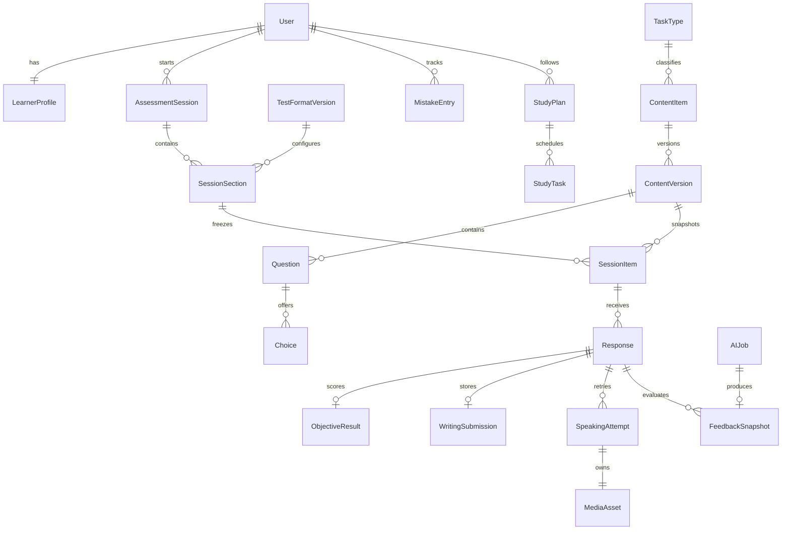

# CELPIP-General Practice Platform Plan

Status: Phases 1–10 implemented (candidate dashboard completion)

Last verified against official CELPIP sources: 29 August 2026

Target exam date for the owner's profile: 10 October 2026

## 1. Purpose and scope

This project will be an original, full-stack practice platform for candidates preparing for the four-skill **CELPIP-General test used for immigration**. It is not a CELPIP-General LS product.

The platform will help a learner understand the test, practise individual tasks, complete realistic mock sessions, revisit mistakes, and follow a performance-based study plan. It will eventually support AI-assisted question drafting, writing feedback, speaking transcription and feedback, and study recommendations.

The application will be independent and unofficial. It must say clearly that it is not affiliated with, endorsed by, or operated by CELPIP or Prometric. “CELPIP” is used only to identify the test being prepared for.

### Product goals

- Be useful immediately for preparation before 10 October 2026.
- Cover Listening, Reading, Writing, and Speaking in the real test order.
- Make Learn, Practice, and Mock modes meaningfully different.
- Give useful feedback without presenting AI output as an official score.
- Keep original content reviewable, versioned, and traceable.
- Retain the polished visual language of the existing LifeInTheUk app.
- Teach Django and backend concepts through small, reviewable phases.

### Non-goals for the first release

- Reproducing official free or paid CELPIP questions, transcripts, audio, diagrams, images, sample responses, or explanations.
- Predicting an official CELPIP score or inventing a raw-score-to-level conversion.
- Building every skill and the complete mock engine in Phase 1.
- Offline-first synchronization. The backend will be the source of truth in v1.
- Supporting CELPIP-General LS as a separate product.
- Optimising for production deployment before the learning and practice flows work.

## 2. Verified 2026 test facts

These facts define the initial simulator configuration. They must be stored as configurable/versioned test-format data rather than scattered as magic numbers in React components.

| Component | Current public structure | Current total time |
| --- | --- | --- |
| Listening | Problem Solving (8), Daily Life Conversation (5), Information (6), News Item (5), Discussion (8), Viewpoints (6) | 46–55 minutes |
| Reading | Correspondence (11), Apply a Diagram (8), Information (9), Viewpoints (10) | 43–56 minutes |
| Writing | Writing an Email (1), Responding to Survey Questions (1) | 53 minutes |
| Speaking | Giving Advice, Personal Experience, Describing a Scene, Making Predictions, Comparing and Persuading, Difficult Situation, Opinions, Unusual Situation (1 each) | 15 minutes |

The CELPIP-General component order is Listening → Reading → Writing → Speaking. Listening and Reading may contain unscored test-development content that is indistinguishable to the candidate. Component levels use the 0–12 range. Writing and Speaking are assessed across Content/Coherence, Vocabulary/Lexical Range, Readability or Listenability, and Task Fulfilment.

Primary sources:

- [Official CELPIP test format](https://www.celpip.ca/take-celpip/test-format/)
- [2026 CELPIP-General Overview Study Pack](https://www.celpip.ca/wp-content/uploads/2026/03/CELPIP-General-Overview-Study-Pack-2026.pdf)
- [Official score comparison chart and descriptors](https://www.celpip.ca/prepare-for-celpip/score-comparison-chart/)
- [Official free preparation resources](https://www.celpip.ca/prepare-for-celpip/free-resources/)

Official sources are for structure and preparation research only. Their practice content must not be copied into our question bank.

### Accuracy policy

Before each mock-engine release, and at least every three months, a maintainer will compare the active `TestFormatVersion` with the official format page and current guidebook. A change requires a reviewed data migration or new format version, regression tests, and a dated note in the plan/changelog. Existing attempts retain the format version under which they were taken.

## 3. Current repository audit

### CELPIP target repository

The target repository was empty at the start of this planning phase. No frontend, backend, database schema, tests, or deployment configuration existed. This document is the only intended product artifact in this phase.

### LifeInTheUk reference application

The sibling `LifeInTheUk` project currently contains:

- React 19, TypeScript, Vite 6, Tailwind CSS v4, React Router, Zustand, Dexie, and Lucide React.
- A Hono/Node API and PostgreSQL schema for accounts and progress sync.
- Browser-side question JSON, a question builder, IndexedDB guest progress, and SM-2 review scheduling.
- Routes for Home, Practice, Study, Test, Results, Progress, Sign In, Sign Up, Reset Password, and Account.
- Reusable UI primitives in `src/components/ui.tsx` and the responsive shell in `src/components/Layout.tsx`.
- Design tokens in `src/index.css`: midnight navy, warm bronze, semantic feedback colours, cards, pill buttons, shadows, motion, and light/dark/system themes.
- A desktop sticky header and a floating mobile bottom navigation.
- Accessibility details including visible focus states, reduced-motion handling, labels, status/alert roles, and large touch controls.

## 4. Design reuse and rejection matrix

| Reference decision | CELPIP decision | Reason |
| --- | --- | --- |
| Midnight navy/bronze tokens | Reuse and rename as CELPIP design tokens | Serious, calm, high-contrast visual identity |
| Cards, pills, semantic status colours | Reuse | Consistent and already polished |
| Inter/system typography | Reuse | Clear at long reading lengths |
| System/light/dark theme | Reuse | Comfort during extended study |
| Sticky desktop header | Reuse and expand | Supports the larger information architecture |
| Mobile bottom navigation | Adapt | Show 4–5 primary items plus More; never squeeze seven tabs |
| Focus-visible and reduced motion | Reuse and test | Accessibility requirement |
| Two-field account creation | Reuse | Registration should not obstruct practice |
| Hono backend | Replace | The requested backend is Django/DRF |
| Raw SQL applied on startup | Replace with Django migrations | Auditable schema history and safer evolution |
| Browser-owned JSON bank | Replace with PostgreSQL and editorial workflow | Review, provenance, versioning, permissions, and analytics |
| IndexedDB as a second progress source | Defer | Sync conflict rules become risky with autosave and recordings |
| Six-character password as the whole security strategy | Adapt | Keep the easy UX; add secure hashing, throttling, safe tokens, and recovery |
| Security-question recovery | Do not copy as the primary recovery method | Answers are guessable; prefer a one-time recovery code and optional email reset |
| One pass/fail percentage | Reject | CELPIP-General reports skills separately; immigration targets may differ per skill |

### Adapted visual system

The initial UI should retain the reference palette and tactile restraint:

- Primary: midnight navy `#0B0B45`.
- Accent: accessible warm bronze based on `#966238`, with contrast checked for each use.
- Cards: white/dark raised surfaces, subtle borders, 16px radius, restrained shadows.
- Buttons: pill shape for major actions; conventional controls inside the timed exam workspace where speed matters.
- Typography: Inter with system fallbacks; monospaced numerals for timers and scores.
- Motion: short feedback transitions only, disabled by `prefers-reduced-motion`.
- Touch targets: at least 44×44 CSS pixels.

The reference’s page-flip animation can be used for untimed study cards, but not for mock navigation where motion could distract or obscure state.

## 5. Information architecture and page structure

Desktop navigation:

1. Dashboard
2. Learn
3. Practice
4. Mock Tests
5. Mistake Bank
6. Progress
7. Study Plan

Mobile bottom navigation should contain Dashboard, Practice, Mock, Progress, and More. More contains Learn, Mistake Bank, Study Plan, Account, theme controls, and sign out.

### Primary pages

- Dashboard: exam date/countdown, target, four skill estimates, readiness, today’s work, recent attempts, strongest/weakest skill, streak, totals, and next recommendation.
- Learn: task-type guides, strategy, timing, original examples, and common mistakes.
- Practice: skill → task type → difficulty selection and an exercise player.
- Mock Tests: start/resume history, readiness warning, test workspace, and delayed results.
- Mistake Bank: filters, repeated patterns, review queue, and resolved items.
- Progress: four independent trends, task-type accuracy, practice volume, and AI-estimate history.
- Study Plan: preferences, calendar/list, daily tasks, completion, and plan adaptations.
- Account: loose registration, profile, exam date, target level, study availability, recovery, export, and deletion.

### Exam workspace

The exam workspace is visually separate from normal navigation. It contains a section label, server-derived timer, progress, prompt/stimulus area, response area, save state, and permitted navigation. Mock mode hides explanations and locks disallowed navigation. Learning mode may show strategy and, after submission, transcripts/evidence. Practice mode sits between them.

On narrow screens, reading stimulus and questions stack. On larger screens, they may use a resizable two-column layout. Speaking shows preparation and recording states prominently. Timer information must never rely on colour alone and should use an ARIA live announcement only at meaningful thresholds, not every second.

## 6. System architecture

```text
React SPA
  ├─ pages and feature components
  ├─ TanStack Query server-state cache
  ├─ small UI/session state stores
  └─ typed API client
          │ HTTPS / JSON; multipart or signed uploads
          ▼
Django REST API
  ├─ serializers/API views (transport and validation)
  ├─ permissions and throttling
  ├─ selectors (read queries)
  ├─ services (business operations)
  └─ async job boundary
          │
          ├─ PostgreSQL: users, content, sessions, attempts, plans, analytics
          ├─ private object storage: audio and protected assets
          └─ AI provider interfaces: generation, transcription, evaluation
```

The backend owns permissions, published content, session state, deadlines, scoring, autosave versions, and study-plan decisions. React may optimistically display a save state, but it does not declare an attempt submitted or scored until the API confirms it.

Phase 1 can run async jobs synchronously behind an interface or use a database-backed job status without introducing Redis/Celery. Celery and Redis should be added when transcription/evaluation work makes background workers necessary, not merely because Django projects often use them.

### Dependency rules

- Domain apps do not import React concepts or provider SDKs.
- `content` does not depend on user attempts.
- `assessments` may read published content versions and accounts.
- `feedback` may read submitted responses but may not mutate them.
- `study_plans` consumes results/mistakes through services, not private model internals.
- Provider-specific OpenAI code lives only in `ai_services/providers/`.
- API views remain thin: validate → authorize → call service/selector → serialize.

## 7. Proposed repository and module structure

```text
/
├─ backend/
│  ├─ manage.py
│  ├─ config/                 # settings, root URLs, ASGI/WSGI
│  ├─ apps/
│  │  ├─ accounts/            # user, profile, authentication, preferences
│  │  ├─ content/             # task types, authored content, versions, review
│  │  ├─ assessments/         # sessions, sections, responses, timers, scoring
│  │  ├─ media_assets/        # private uploads and signed access
│  │  ├─ feedback/            # rubric feedback and immutable snapshots
│  │  ├─ ai_services/         # provider-neutral contracts and AI jobs
│  │  ├─ mistakes/            # detected/manual mistakes and review state
│  │  ├─ study_plans/         # preferences, plans, tasks, adaptation
│  │  └─ analytics/           # read models/selectors for dashboards
│  ├─ tests/
│  └─ requirements/           # base/dev files or pyproject.toml
├─ frontend/
│  ├─ src/
│  │  ├─ app/                 # router, providers, app shell
│  │  ├─ components/ui/       # Button, Card, Field, Meter, Dialog, Timer
│  │  ├─ features/
│  │  │  ├─ auth/ dashboard/ learn/ practice/ mocks/
│  │  │  ├─ listening/ reading/ writing/ speaking/
│  │  │  └─ mistakes/ progress/ study-plan/
│  │  ├─ lib/                 # API client, date/audio helpers
│  │  ├─ styles/              # tokens and global CSS
│  │  └─ test/
│  └─ e2e/
├─ docs/
│  ├─ CELPIP_PLATFORM_PLAN.md
│  └─ adr/
├─ .env.example
└─ README.md
```

## 8. Django apps and beginner concepts

| App | Responsibility |
| --- | --- |
| `accounts` | Custom user, learner profile, exam date, target, study preferences, recovery |
| `content` | Stable task-type codes, original materials, choices, answer keys, provenance, editorial states |
| `assessments` | Learn/practice/mock sessions, frozen content snapshots, responses, autosave, objective scoring |
| `media_assets` | Metadata and authorization for private audio/images; storage adapter |
| `feedback` | Rubric results, strengths, weaknesses, issues, comparisons, immutable feedback snapshots |
| `ai_services` | Typed provider interfaces, prompt/model versions, jobs, usage and failure metadata |
| `mistakes` | Repeated error categories, evidence links, mastery/review scheduling |
| `study_plans` | Plan preferences, scheduled tasks, adaptations and rationale |
| `analytics` | Dashboard/progress selectors; no independent source-of-truth score table |

### How to think about Django

- A **model** is a Python description of stored data and its constraints.
- A **migration** is a versioned instruction that moves the database schema from one known state to the next. `makemigrations` writes it; `migrate` applies it.
- A DRF **serializer** validates incoming JSON and converts Python/model objects into response JSON. It is an API boundary, not the home for a whole scoring algorithm.
- A **ViewSet** groups conventional list/create/read/update endpoints. An `APIView` is useful for action-shaped operations such as submit or refresh. Neither should become a giant business-logic file.
- A **service** performs a write-oriented business operation such as `submit_session(...)` in one transaction.
- A **selector** performs a named, reusable read query such as `dashboard_for_user(...)`.

Read this expression from the inside/right toward the outside/left:

```python
published = ContentVersion.objects.filter(
    content__skill=Skill.READING,
    status=PublicationStatus.PUBLISHED,
).select_related("content").order_by("content__task_type", "version")
```

Start with `ContentVersion.objects` (the table-like manager), filter it, ask Django to join each related content row efficiently, then order the final query. The query is lazy: Django normally talks to PostgreSQL only when the result is iterated, sliced, counted, or otherwise evaluated.

## 9. Main data entities and relationships



### Important fields and constraints

- `LearnerProfile`: `exam_date`, `target_level`, minutes/day, timezone, preferred days. The owner may be seeded with `2026-10-10`; the date is never a global constant.
- `TaskType`: stable code such as `LISTENING_PROBLEM_SOLVING` or `SPEAKING_GIVING_ADVICE`, skill, display name, active format versions.
- `ContentItem`: stable identity, task type, topic, difficulty, estimated level, `source_type` (`human_authored` or `ai_draft`), author and origin note.
- `ContentVersion`: immutable version number, payload, status, reviewer, review timestamps, rubric/schema version, and checksum. Unique `(content_item, version)`.
- `Question`/`Choice`: ordered objective items. Correct answers are never sent in an active mock response.
- `MediaAsset`: owner/content link, private storage key, media type, size, duration, checksum, scan/validation state. It does not store a public URL.
- `AssessmentSession`: user, mode, format version, state, start/deadline/submit times, last activity, score-release policy.
- `SessionItem`: immutable reference/snapshot of the content version, order, points, and whether it represents simulated unscored content. The learner is never told which item is simulated-unscored during a mock.
- `Response`: state, client idempotency key, server revision, saved/submitted timestamps.
- `WritingSubmission`: text, word count, revision number. Submitted content is immutable; later retries are new responses.
- `SpeakingAttempt`: attempt number, preparation/recording duration, media asset, transcript status, and optional prior-attempt link.
- `ObjectiveResult`: raw correct, raw possible, question-level outcomes. No guessed official level conversion.
- `FeedbackSnapshot`: label, estimated level, rubric dimensions, strengths, weaknesses, issues, next steps, model/prompt/rubric version, created time. Never overwritten.
- `MistakeEntry`: category, skill/task type, evidence response/question, count, severity, next review, resolved state.
- `StudyPlan`/`StudyTask`: date range, input snapshot, scheduled activity, reason, status, and adaptation/version number.
- `AIJob`: capability, provider identifier, status, input/output schema versions, model, prompt version, token/usage cost, latency, error code, retries. Secret provider configuration remains in environment/server settings, never a JSON database field.

All user-owned querysets must be scoped by the authenticated user. Foreign keys and uniqueness constraints should enforce ownership and idempotency in PostgreSQL, not only in React.

## 10. Domain state machines

```text
Content: draft → in_review → published → retired
                   ↘ changes_requested → draft

Session: not_started → in_progress → submitted → scoring → completed
                              ↘ abandoned
                  in_progress → timed_out → scoring

Response: empty → saved (revision n) → submitted → scored/evaluated

Media: pending_upload → uploaded → validated → available
                              ↘ rejected

AI job: queued → running → succeeded
                  ↘ retryable_failed → queued
                  ↘ permanently_failed

Study task: planned → in_progress → completed
                         ↘ skipped
```

Only reviewed human action may move content to `published`. AI generation creates `draft` content. Mock sessions use a frozen list of published versions so later editing cannot alter a completed attempt.

## 11. Representative REST API

All endpoints are under `/api/v1/`. Responses use a consistent error shape such as `{ "code": "stale_revision", "message": "…", "fields": {} }`. List endpoints are paginated. API documentation will be generated from an OpenAPI schema.

| Method and path | Purpose |
| --- | --- |
| `POST /auth/register` | Accept one identifier and one password; issue session tokens |
| `POST /auth/login`, `/auth/refresh`, `/auth/logout` | Authenticate, rotate, revoke |
| `POST /auth/recovery-code/reset` | Recover with a high-entropy one-time code |
| `GET/PATCH /me/profile` | Exam date, target, availability |
| `GET /task-types` | Active, format-versioned task catalogue |
| `GET /content` | Published learner-visible content; staff filters include drafts |
| `POST /staff/content/{id}/submit-review` | Editorial transition |
| `POST /staff/content/{id}/publish` | Human-only publish action |
| `POST /sessions` | Start Learn, Practice, section mock, or full mock |
| `GET /sessions/{id}` | Resume from server state and server deadline |
| `PUT /sessions/{id}/responses/{item_id}` | Idempotent autosave with expected revision |
| `POST /sessions/{id}/submit` | Idempotent final submission |
| `GET /sessions/{id}/results` | Results only when release policy permits |
| `POST /speaking-attempts/{id}/upload-intent` | Validate intent and issue private signed upload |
| `POST /speaking-attempts/{id}/upload-complete` | Verify stored object before accepting it |
| `POST /speaking-attempts/{id}/retry` | New comparable attempt |
| `GET /mistakes`, `POST /mistakes/{id}/review` | Mistake queue and review outcome |
| `GET /progress`, `GET /dashboard` | Read-optimised summaries |
| `GET/PUT /study-plan/preferences` | Study inputs |
| `POST /study-plans/generate`, `GET /study-plans/current` | Generate/read a versioned plan |

Autosave requests carry an `Idempotency-Key` and expected `revision`. The service uses a database transaction and row lock or conditional update. Repeating the same request returns the same result; a stale conflicting revision returns HTTP 409. Mock deadlines come from the server clock. The client timer is a display of `deadline_at - server_now`, not the authority.

## 12. Authentication, security, and privacy

Registration intentionally mirrors the reference app’s low friction:

- One “username or email” field.
- One password field with no confirmation field.
- No mandatory verification email before the learner can practise.
- Initial proposal: six-character minimum and no composition puzzle, matching the reference; review this before public launch.
- Show a high-entropy recovery code once. If an email is supplied, email reset may also be offered. Do not make guessable security questions the primary recovery method.

Easy registration does not mean weak storage or sessions. Django hashes passwords using Argon2 (configured preferred hasher), auth endpoints are throttled by identifier and IP, error messages do not reveal whether an account exists, and recovery tokens are hashed and single-use.

The proposed SPA token design is a short-lived access JWT held only in memory and a rotating refresh token in an `HttpOnly`, `Secure`, appropriately scoped `SameSite` cookie. Because cookie and frontend origins affect CSRF/CORS behaviour, final same-origin versus cross-origin deployment is an ADR that must be resolved before Phase 1 auth is coded. Refresh/logout endpoints require CSRF protection if cookies are sent automatically. Token reuse revokes the token family.

Other requirements:

- Server-only secrets loaded through environment variables; `.env.example` contains names, never values.
- Object storage is private. Signed URLs are short-lived and issued only after ownership checks.
- Validate upload extension, declared MIME type, magic bytes, size, decoded duration, and supported codec. Randomize storage keys and scan uploads where feasible.
- Apply DRF permissions and queryset ownership filters to every user resource.
- Validate all serializer input and cap text/array/file sizes.
- Audit content publication, staff access, account recovery, data export/deletion, and AI evaluation requests.
- Define retention separately for recordings, transcripts, submitted writing, AI provider logs, and deleted accounts. Provide export and deletion flows before public launch.
- Do not send recordings or responses to an AI provider until the user has been informed and the relevant privacy setting/consent is recorded.

## 13. Scoring and adaptive learning boundaries

Listening and Reading store objective raw results: correct count, possible count, task type, and question outcomes. Writing and Speaking store rubric feedback and explicitly non-official estimates. These values must not share a field named simply `score`.

The UI may display:

- “Listening practice accuracy: 31/38”
- “Estimated CELPIP Level: 8”
- “Practice Score Estimate”

It must not display “Your official CELPIP score will be 8.” No raw-to-level table will be invented. If a defensible public conversion is later available, it must be source-dated, versioned, tested, and labelled as a practice approximation.

Overall readiness is a transparent planning indicator, not a fifth CELPIP score. Its explanation should show inputs such as recency, practice volume, task coverage, consistency, and distance from the learner’s target. The adaptive plan increases work for weaker/under-practised skills while maintaining spaced review of stronger ones. Every generated task records a human-readable reason.

## 14. Testing, accessibility, and observability

### Automated tests

- Backend unit tests: state transitions, content validation, objective scoring, deadline rules, plan allocation, mistake aggregation, and provider normalization.
- Backend API tests: permissions, registration/login/refresh/recovery, draft visibility, autosave idempotency and conflicts, submit replay, signed URL ownership, pagination, and throttling.
- Migration tests: clean database migration and important data migrations.
- Frontend component tests: fields, dialogs, timers, word count, audio states, feedback panels, navigation, and error/retry states.
- Contract tests: generated TypeScript client/schema agrees with DRF OpenAPI.
- Playwright journeys: loose registration, set exam date, Reading practice, resume writing, mock feedback delay, speaking record/retry, and mistake review.
- Accessibility tests: keyboard-only operation, focus order/restoration, screen-reader labels, contrast, reduced motion, zoom/reflow, and non-colour status cues.
- Timer tests use a fake clock; audio tests use mocked `MediaRecorder` plus browser-level tests on supported engines.
- Content quality gates: stable IDs, task-type validity, unique/near-duplicate detection, answer-key validity, complete explanations, asset/transcript association, provenance, and human approval before mock eligibility.

### Observability

Use structured logs with request/correlation IDs, never response text or audio content by default. Track API error rate/latency, autosave conflicts, abandoned sessions, upload/transcription failures, AI latency/usage/cost, content version, and mock completion. Add error monitoring before beta. Analytics events must avoid prompt/response content and other unnecessary personal data.

## 15. Development roadmap

Each phase is a review boundary. A phase is not complete merely because screens exist.

### Phase 1 — Foundation, account, profile, dashboard shell

**Status:** implemented.

Goal: establish the smallest end-to-end Django/React slice.

Deliverables: monorepo tooling; design tokens and responsive shell; Django/DRF/PostgreSQL; custom user; loose registration/login/logout/refresh; profile with exam date, target, minutes/day and study days; owner seed/setup path for 10 October 2026; dashboard API and honest empty-state shell.

Learning: Python environment, Django project versus app, model/migration, serializer, URL, API view, service, permission, React query/mutation, environment variables.

Tests: clean migrations; model constraints; register/login/refresh/logout; profile ownership/validation; countdown timezone cases; frontend auth/profile/dashboard flows; keyboard and axe checks.

Exit: a new user can register with two fields, set the plan inputs, refresh safely, and see an accurate countdown/dashboard empty state. No practice engine yet.

### Phase 2 — Question bank and Reading practice

**Status:** implemented.

Deliverables: task types, format versions, content/version/editorial models, Django admin workflow, original Reading seed set, Practice session engine, objective responses, scoring, explanations, and content validation command.

Learning: relationships, choices/enums, transactions, admin customization, fixtures/management commands, selectors/services.

Tests: editorial transitions, AI-draft publishing guard, version freezing, all four Reading types, scoring, explanation release, duplicates and malformed answers.

Exit: reviewed original Reading content completes end to end in learning and timed practice modes.

### Phase 3 — Listening and audio

**Status:** implemented.

Deliverables: private media abstraction, original Canadian-context recordings/transcripts, playback policy, exam replay limits, post-answer transcript/evidence, listening question flow.

Learning: object storage, media metadata, signed URLs, browser audio events, authorization.

Tests: unauthorized audio denial, URL expiry, playback policy, all six task types, transcript release, media validation and keyboard controls.

Exit: a complete reviewed Listening practice section works without leaking transcript/answers early.

### Phase 4 — Writing practice

**Status:** implemented.

Deliverables: both writing tasks, timer, editor, word count, revision-aware autosave, final immutable submission, response history, feedback placeholder/rubric schema.

Learning: debouncing, optimistic concurrency, idempotency, transaction boundaries, text validation.

Tests: fake-clock timing, reload/resume, offline/error notice, stale revision 409, duplicate submission, word count, ownership.

Exit: a learner cannot lose a normally autosaved response and can review the submitted version.

### Phase 5 — Speaking recording and retry

**Status:** implemented.

Deliverables: all eight task shells, preparation/recording countdowns, permission handling, recording/upload/replay, private access, retry and attempt comparison shell.

Learning: `MediaRecorder`, codecs, blobs, signed uploads, asynchronous state machines.

Tests: denied microphone, unsupported browser, upload failure/retry, duration/size enforcement, access control, Attempt 1/2 linkage.

Exit: recordings are reliably captured, privately stored, replayed by their owner, and retried.

### Phase 6 — AI services and feedback

**Status:** implemented and audited.

Deliverables: provider-neutral contracts; async jobs; writing evaluation; speaking transcription/evaluation; prompt/model/rubric versioning; immutable feedback; human-review tools for generated content.

Learning: interfaces/abstract base classes, adapters, background work, structured output validation, retries and privacy.

Tests: provider contract/fakes, malformed output, timeout/retry, labels/disclaimers, prompt-version snapshots, AI drafts never publishing automatically.

Exit: switching a fake provider and configured provider requires no domain/UI rewrite, and every estimate is auditable and non-official.

### Phase 7 — Study plan, mistakes, and analytics

**Status:** implemented.

Deliverables: mistake taxonomy, repeat detection, review queue, four-skill trends, streak/volume, explainable readiness, plan generation/adaptation and task calendar.

Learning: aggregation, scheduling rules, explainable recommendations, query optimization.

Tests: repeated issue merging, plan weighting, no starvation of strong skills, timezone/streak edges, query counts, transparent recommendation reasons.

Exit: new results version the plan and visibly change future tasks for a defensible reason.

### Phase 8 — Full mock exams

**Status:** implemented (compact task-family mock).

Deliverables: frozen test assembly, Listening → Reading → Writing → Speaking progression, server deadlines, autosave, restricted navigation, abandon/resume rules, simulated unscored-item support, delayed feedback, section results and summary.

Learning: orchestration, state machines, server/client clock reconciliation, failure recovery.

Tests: full fake-clock mock, refresh/reconnect, timeout, double submit, no early corrections, content retirement mid-session, exact format-version assembly.

Exit: a full mock completes reliably and results never reveal corrections before the configured release state.

### Phase 9 — Production hardening and account privacy

**Status:** implemented.

Deliverables: privacy-safe account export (`GET /api/v1/me/export/`), self-service account deletion (`DELETE /api/v1/me/`) with password or recovery-code confirmation and owned-data cascade, account privacy UI (Download my data plus a gated danger zone), a dry-run retention command, request/correlation IDs with structured logging, and enforced production settings (TLS/HSTS and security headers).

Learning: production settings, data-export/deletion boundaries, retention, observability, incident/backup thinking.

Tests: export never leaks hashes, tokens, answer keys, other users, or private audio; deletion confirms and cascades; retention is dry-run by default; production settings fail fast on missing secrets; structured logs exclude response bodies and audio; account privacy UI smoke and accessibility checks.

Exit: the beta release checklist passes with no critical accessibility/security issues, documented recovery/rollback, and a self-service account privacy path in the frontend.

### Phase 10 — Candidate dashboard

**Status:** implemented.

Deliverables: a cohesive authenticated Dashboard at `GET /api/v1/me/dashboard/` backed by a single selector/service payload (`learning.services.dashboard_payload`). The payload layers the existing progress measures with totals, study streak, recent results, practice signals, today's tasks, the next upcoming task, and a transparent readiness planning indicator. The frontend Dashboard is split into focused, accessible subcomponents (stats, today's tasks, skill estimates, practice signals, recent results, readiness) with loading, error, empty, and anonymous states.

Learning: read-model composition, cross-entity activity-date aggregation, honest uncertainty labelling, and deterministic score-free planning signals.

Tests: streak anchoring and boundaries, future-date exclusion, gap and zero cases, timezone day boundaries, authentication and owner scoping, empty/partial/full evidence, signal ordering, recent-result ordering and limit, readiness formula determinism and recency decay, today/next-upcoming task selection, and frontend state/accessibility coverage.

Exit: the dashboard reads cleanly for a learner with or without prior practice, and no number on the page claims to be a CELPIP score.

#### Readiness indicator (practice planning only)

The overall readiness value is deliberately not a CELPIP score and never predicts one. It is an **unofficial practice planning indicator** computed from evidence the learner has produced in the app. Its formula is deterministic and fully explained in the UI:

```
readiness = 0.30 × coverage + 0.25 × recency + 0.25 × volume + 0.20 × performance
```

Each component is normalised to 0–100:

- **coverage** — the share of the four skills with at least one objective result or AI-assisted estimate (0, 25, 50, 75, or 100).
- **recency** — 100 for activity today, minus 10 per full day since the most recent activity (floor 0).
- **volume** — 10 points per completed attempt, capped at 100. A completed attempt is a submitted session, counted even when AI feedback is still queued or failed.
- **performance** — the average of the per-skill *practice planning signals* described below (0 when no signals exist).

The component weights, values, and plain-language explanations are surfaced to the learner, and every component is displayed alongside the formula so the number is auditable. When no completed attempts exist, readiness returns `state="insufficient_evidence"` and `indicator=null` (no number) rather than a misleading zero; otherwise it returns `state="estimated"`.

#### Practice planning signals (cross-skill comparison)

Cross-skill comparison uses a per-skill **practice planning signal**, normalised to 0–100, and never labelled as a CELPIP level:

- **Listening / Reading** — objective accuracy (already 0–100).
- **Writing / Speaking** — the AI-assisted estimate midpoint divided by 12 and multiplied by 100, because AI estimates use the CELPIP 0–12 scale while objective accuracy uses percentages. (0 → 0, 12 → 100.)

Unpractised skills are reported as **needs-attention** with the basis "No practice recorded yet", and are never silently scored zero. Among practised skills, the strongest signal becomes the *strongest* card and the weakest the *needs-attention* card; an unpractised skill otherwise takes precedence for needs-attention. Objective accuracy and AI estimates remain distinct measures and are never combined into a single skill number.

## 16. Full-exam simulation expansion

The current Phase 8 mock remains available as a compact task-family simulation. It is useful for
short practice and regression testing, but it must not be described as a complete live-test
replacement while Listening and Reading contain fewer objective questions than the current
CELPIP-General test. The expansion below is deliberately split into two reviewable phases.

### Phase 11 — Full-length content and scoring-ready assembly

**Status:** planned.

Goal: expand the compact mock into a complete-length, format-versioned simulation using only
original, human-reviewed content.

Deliverables:

- Expand Listening to the current full question counts: 8 / 5 / 6 / 5 / 8 / 6 across its six parts.
- Expand Reading to the current full question counts: 11 / 8 / 9 / 10 across its four parts.
- Keep one Writing Email task, one Writing Survey task, and all eight Speaking tasks in the official order.
- Assemble enough reviewed content variants that repeated mock attempts do not reuse the same complete test unnecessarily.
- Activate simulated unscored Listening and Reading items where the active format version calls for them. They must be indistinguishable from scored items during the attempt and excluded from objective results after submission.
- Preserve immutable snapshots of the selected content, format version, scoring policy, and simulated-unscored flags for every attempt.
- Keep raw practice results separate from official CELPIP scoring. Do not invent a raw-score-to-level conversion.
- Add content-quality gates for full mocks: coverage, difficulty balance, duplicate detection, answer-key validity, explanation completeness, audio/transcript fidelity, and human approval.

Learning: content assembly at scale, test blueprints, format versioning, item exposure policy,
scoring boundaries, and editorial quality control.

Tests: exact full-count assembly, variant selection, no duplicate item leakage within an attempt,
unscored-item exclusion, immutable snapshots, answer-key protection, format-version migration,
and raw-result accuracy.

Exit: a learner can complete a full-length original mock with the current official task counts,
and the result clearly reports practice performance without claiming to be an official CELPIP score.

### Phase 12 — Realistic exam-day experience and validation

**Status:** planned.

Goal: make the full-length simulation behave and feel like a real computer-delivered CELPIP
session, while remaining honest about what an independent platform cannot reproduce.

Deliverables:

- Add a preflight screen covering device/audio checks, microphone permission, volume, browser compatibility, timing rules, and the no-corrections-until-completion policy.
- Reproduce official section order, section transitions, preparation/response countdowns, sequential task flow, and server-authoritative deadlines.
- Match Listening behavior: one-playback timed mode, note-taking area, answer-choice/question presentation, and section-specific navigation rules.
- Match Reading behavior: full passage/question flow, visible progress, question navigation rules, and section deadline handling.
- Match Writing behavior: two consecutive timed tasks, persistent word count, autosave status, final-submit confirmation, and immutable submissions.
- Match Speaking behavior: preparation countdown, response countdown, recording state, microphone recovery, playback confirmation, and automatic transition to the next task.
- Add robust refresh, reconnect, timeout, browser-close, and resume handling without granting extra time.
- Add a completion review showing time used, unanswered items, task-family performance, and targeted next steps—not a fake overall level.
- Add an explicit “Full simulation” label and retain the compact mock as a faster alternative.
- Validate the experience with supported-browser, mobile-width, keyboard, screen-reader, reduced-motion, and real-device audio testing.

Learning: exam-mode UX, resilient timed workflows, browser media constraints, accessibility, and
realistic test-day preparation.

Tests: Playwright full-exam journey, fake-clock section expiry, reconnect/resume, browser refresh,
microphone denial/retry, one-playback enforcement, no early feedback, keyboard-only operation,
screen-reader timer announcements, and mobile reflow.

Exit: the full simulation is reliable enough for exam rehearsal, users understand its limits before
starting, and the app never suggests that its content, AI feedback, or results are official CELPIP
material or scoring.

## 17. Architecture decisions and risks

### Accepted decisions

- ADR-001: Django/DRF/PostgreSQL replace Hono/raw startup SQL.
- ADR-002: React/TypeScript/Vite/Tailwind v4 and the reference design language are retained.
- ADR-003: PostgreSQL is authoritative in v1; IndexedDB synchronization is deferred.
- ADR-004: content and immutable versions are separate; mock sessions freeze versions.
- ADR-005: objective results and AI estimates are different domain records.
- ADR-006: AI providers and private storage sit behind replaceable interfaces.
- ADR-007: registration is deliberately two-field and does not require verification before practice.

### Decisions to confirm before Phase 1 code

1. Same-origin deployment with cookie-based refresh versus split frontend/API origins. Same-origin is recommended because it simplifies cookies, CORS, and CSRF.
2. Whether completely anonymous users can save server-side practice, or whether “guest” means no-account sample practice only. Recommended v1: sample Learn/Practice works without an account, persistent history/recordings require the loose account.
3. Confirm the six-character password minimum for launch. It matches the reference UX; a longer minimum improves resistance to guessing without adding a composition puzzle.
4. Whether the target is one private owner initially or multi-user from Phase 1. Models and permissions should be multi-user safe even if only one account is used.
5. Initial audio storage: local private development storage behind the adapter, moving to S3-compatible storage before deployment.
6. Whether target level is one overall preference or four per-skill targets. Recommended: one default target plus optional per-skill overrides.

### Main risks and mitigations

| Risk | Mitigation |
| --- | --- |
| Official format changes | Versioned format config and quarterly/pre-release revalidation |
| Copyright/proprietary content leakage | Original-only policy, provenance, duplicate review, human publish gate |
| AI gives confident bad advice | Typed rubrics, eval fixtures, immutable audit data, uncertainty and non-official labels |
| Mock timers drift or can be bypassed | Server deadline, clock reconciliation, fake-clock tests |
| Autosave overwrites newer work | Revision numbers, idempotency keys, conflict response and recovery UI |
| Recordings leak | Private bucket, ownership checks, signed URLs, strict validation and retention |
| Too many Django apps too early | Create apps only as their phase begins; keep interfaces in the plan until needed |
| Dashboard creates false confidence | Explain inputs, keep four skills separate, show evidence/coverage |
| Guest/account merge complexity | Do not implement local/server bidirectional sync in v1 |
| Seven-item mobile navigation becomes crowded | Four primary items plus More overflow |

## 18. Proposed next slice for review

After this architecture is approved, implement only Phase 1A: repository foundation and the static responsive shell. Authentication can be the following slice so the learner can review Django concepts before a large change.

Proposed Phase 1A files:

```text
README.md
.gitignore
.env.example
backend/manage.py
backend/config/__init__.py
backend/config/settings/base.py
backend/config/settings/dev.py
backend/config/urls.py
backend/config/asgi.py
backend/pyproject.toml
frontend/package.json
frontend/vite.config.ts
frontend/tsconfig.json
frontend/src/main.tsx
frontend/src/app/App.tsx
frontend/src/app/router.tsx
frontend/src/app/AppShell.tsx
frontend/src/components/ui/Button.tsx
frontend/src/components/ui/Card.tsx
frontend/src/styles/index.css
frontend/src/pages/placeholder-pages.tsx
frontend/src/test/AppShell.test.tsx
```

Before that slice, review this plan—especially the auth/cookie decision, guest boundary, password minimum, and per-skill targets. No full feature implementation should begin until those choices are understood.

## Agent review note

The technical/domain draft was produced with Qwen CLI and the product/design/roadmap draft with Claude CLI under the decisions in this document. Their raw suggestions were reconciled architecturally: CELPIP-General remains an immigration-focused four-skill product; CELPIP-General LS/citizenship scope was removed; browser/server progress synchronization was deferred; and provider secrets were kept out of database configuration.
